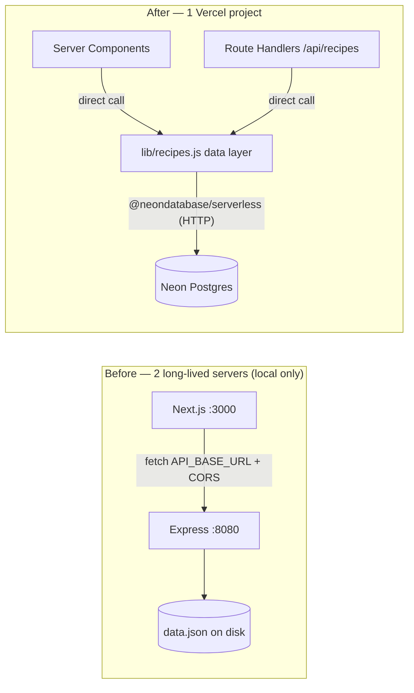

# Vercel Deployment Plan — Recipe Manager

Implementation plan to take this local-only app (separate Express API + Next.js frontend, `data.json` "database") to a single Vercel deployment backed by **Neon Postgres**, while preserving the existing defensive-mapping architecture and leaving clear runway for the README's "advanced features."

> **Status:** Phase 1 is complete and Phase 2 is implemented in this working tree. Phase 3+ remain planned. Steps are ordered so each phase ends at a deployable, working state.

---

## 1. Goal & target architecture

**Recommended approach (from research):**

1. **One Vercel project.** Fold the Express API into the Next.js app as **Route Handlers** (`/api/recipes`, `/api/recipes/:id`), keeping the exact HTTP contract. Server Components call the data layer **directly** (no internal HTTP hop); the route handlers remain as the public JSON API.
2. **Neon Postgres** via the Vercel Marketplace integration (Vercel Postgres is discontinued → Neon). Query over the **`@neondatabase/serverless` HTTP driver**.
3. **Keep the defensive DTO mappers and frontend validators**; swap only the data source (`data.json` → SQL). `data.json` becomes the **seed** source of truth.
4. **Fix caching:** move off `cache: "no-store"` to ISR / `unstable_cache` with tags, so the near-static catalog is cached and invalidated on write.
5. **Fluid compute** (Vercel default) — active-CPU billing, in-function concurrency, cold-start prevention.



**Why fold the backend in (vs. keeping Express as its own Vercel project):** removes CORS entirely, removes the cross-service `API_BASE_URL` hop on every render, one project / one URL / one env-var set. It is **low-risk here because the code is already shaped for it** — all logic lives in `backend-app/src/recipes.js` as pure functions, and `server.js` is a thin 37-line route layer. Keeping the `/api/recipes` route handlers preserves the "API design" evaluation signal.

> Express on Vercel is now zero-config (the current `app.listen` pattern is supported), so "two Vercel projects" remains a valid **fallback** for a first deploy with minimal churn. This plan targets the folded architecture as the destination.

---

## 2. Phase overview

| Phase                                                  | Outcome                                                          | Deployable at end?                     |
| ------------------------------------------------------ | ---------------------------------------------------------------- | -------------------------------------- |
| **0. Prep**                                            | Accounts, CLI, repo root decision                                | n/a                                    |
| **1. Consolidate to one Next app** (still JSON-backed) | API moved into Next route handlers; CORS dropped; tests moved    | ✅ single Vercel project, no DB        |
| **2. Add Neon + swap data source**                     | `getData()` reads Postgres; mappers/tests unchanged              | ✅ Postgres-backed, identical behavior |
| **3. Query-ability + caching**                         | Filters/sort pushed into SQL with indexes; ISR/`unstable_cache`  | ✅ scalable + cached                   |
| **4. Feature enablement (future)**                     | Hooks for favorites (writes/auth), pgvector (LLM), shopping list | incremental                            |

Each phase is independently shippable. You can stop after Phase 1 and already have a working Vercel deployment.

---

## 3. Phase 0 — Prerequisites

- [ ] Vercel account + **Vercel CLI** (`npm i -g vercel`, min v47.0.5 for current Express/`vercel dev` support).
- [ ] GitHub repo connected to Vercel (enables preview deployments).
- [ ] Leave the Vercel project root as the repository root; `backend-app` has already been consumed/retired.
- [ ] Node 20+ locally (Neon serverless driver needs Node 19+).

---

## 4. Phase 1 — Consolidate into one Next.js app (still JSON-backed)

Goal: a single Next.js app that serves the same API and pages, with **no behavior change** and **no database yet**. This proves the consolidation independently of the DB migration.

### 4.1 Move the data logic into the Next app

- Create `lib/recipes.js` from `backend-app/src/recipes.js`.
  - Convert **CommonJS → ESM** (`require`→`import`, `module.exports`→`export`).
  - Keep every mapper/normalizer **unchanged** (`toRecipeListItem`, `toRecipeDetail`, `toIngredientMap`, `parseRecipeAmount`, nutrition math, filter helpers).
  - Keep `getData()` as the **only** data-access seam — for now it still reads JSON.
- Move the data file: `backend-app/db/data.json` → `db/data.json` (becomes the seed source in Phase 2). Update the path in `getData()`.

> ⚠️ Reading a file at runtime on Vercel works only if it's traced into the bundle. This is a **temporary** Phase-1 state; Phase 2 removes file reads entirely. (If you want Phase 1 to be robust on Vercel, `import data from "../db/data.json"` instead of `fs.readFile`.)

### 4.2 Add Route Handlers (preserve the API contract)

Create thin handlers that mirror `backend-app/src/server.js`:

- `app/api/recipes/route.js`

  ```js
  import { NextResponse } from "next/server";
  import { getRecipeList } from "@/lib/recipes";

  export async function GET(request) {
    try {
      const { searchParams } = new URL(request.url);
      const filters = {
        name: searchParams.getAll("name"),
        tag: searchParams.getAll("tag"),
        ingredient: searchParams.getAll("ingredient"),
      };
      return NextResponse.json(await getRecipeList(filters));
    } catch {
      return NextResponse.json(
        { error: "Failed to fetch recipes" },
        { status: 500 },
      );
    }
  }
  ```

- `app/api/recipes/[id]/route.js`

  ```js
  import { NextResponse } from "next/server";
  import { getRecipeDetail } from "@/lib/recipes";

  export async function GET(_request, { params }) {
    try {
      const recipe = await getRecipeDetail(params.id);
      if (!recipe)
        return NextResponse.json(
          { error: "Recipe not found" },
          { status: 404 },
        );
      return NextResponse.json(recipe);
    } catch {
      return NextResponse.json(
        { error: "Failed to fetch recipe" },
        { status: 500 },
      );
    }
  }
  ```

### 4.3 Point the frontend at the in-process data layer

Refactor `app/recipes/recipeData.js`:

- Replace the `fetch(API_BASE_URL/api/recipes...)` calls with **direct calls** to `lib/recipes.js` (`getRecipeList`, `getRecipeDetail`).
- **Keep** the `{ recipes, error }` / `{ recipe, error, notFound }` return contracts so the pages (`app/recipes/page.js`, `app/recipes/[id]/page.js`) need **no changes**.
- **Keep** the runtime validators (`isRecipeListItem`, `isRecipeDetail`, …) as a secondary guard around the data-layer output. The primary defensive layer is now the in-process mappers; the validators stay as belt-and-suspenders (and remain meaningful for external consumers of the route handlers).
- Replace the `fetchImpl` test seam with a data-layer injection seam (default = real `lib/recipes.js`, override in tests).
- The URL/query-string builders (`getRecipesUrl`, `getRecipesQueryString`) are no longer needed for page rendering. Keep them only if you want a typed client for the public API; otherwise remove.

> **Validation note:** with one process, the mappers in `lib/recipes.js` already produce safe DTOs, so `recipeData.js` re-validation is technically redundant. We retain it deliberately (cheap, and protects the page if the data layer is later changed to return raw rows).

### 4.4 Drop CORS and dead config

- Delete `backend-app/src/cors.js` usage; CORS is unnecessary same-origin.
- Remove `CORS_ORIGIN` from docs/env. `API_BASE_URL` is no longer used for internal calls (remove or mark deprecated).

### 4.5 Move the tests

- Port `backend-app/test/recipes.test.js` → `test/` (Jest is configured at the repository root). Update imports to the ESM `lib/recipes.js`. These are **pure-function tests** (no DB), so they move verbatim aside from import syntax.
- Add route-handler tests if desired (call the exported `GET` with a mock `Request`).

### 4.6 Retire the backend package

- Once green, delete `backend-app/` (or keep temporarily as reference). Update `README.md` / `CLAUDE.md` setup commands to reflect the single app.

### 4.7 Verify & deploy (Phase 1 gate)

- [ ] `npm run check` (typecheck + lint + format + tests) passes.
- [ ] `npm run build` succeeds.
- [ ] `vercel dev` locally: `/recipes`, `/recipes/:id`, filtering, not-found, and `/api/recipes*` all behave as before.
- [ ] `vercel deploy` (preview) → smoke test the live URL.

---

## 5. Phase 2 — Add Neon Postgres and swap the data source

Goal: replace `getData()`'s file read with Postgres queries that return the **identical `{ recipes, ingredients }` shape**. Everything downstream still receives the same DTO source shape, and Phase 3 remains responsible for pushing filters/caching deeper into SQL.

Research checked 2026-05-31 against official Vercel and Neon docs:

- Vercel Marketplace storage integrations provision resources from the dashboard and inject connection credentials as environment variables.
- For a new database managed in Vercel, use the **Vercel-Managed Neon Integration**. It supports Preview Branching and creates a Neon project under the Vercel-managed Neon organization.
- Preview Branching injects branch-specific env vars at deployment time; those dynamic preview values may not appear in the project's regular Environment Variables settings.
- The Neon serverless **HTTP** driver is the right runtime default for this app's one-shot reads. It supports non-interactive transactions; use WebSocket `Pool`/`Client` only if a later feature needs session state or interactive transactions.

### 5.1 Confirm Vercel + Neon wiring

- [x] Neon database resource created in the Vercel dashboard for the `hells-kitchen` project (per current project status).
- [ ] In Vercel Dashboard → project → **Storage**, confirm the Neon database is connected to this project for **Development**, **Preview**, and **Production** environments.
- [ ] Under the Neon storage connection's deployment configuration, enable **Preview Branching** and keep **Resource must be active before deployment** enabled so preview builds wait for their database branch.
- [ ] Confirm injected env vars in the connected environments: `DATABASE_URL` (pooled), `DATABASE_URL_UNPOOLED` (direct), and the optional `PG*` components.
- [ ] Link/pull locally from the repository root:

  ```bash
  vercel link
  vercel env pull .env.local --yes
  ```

- [ ] Verify local env without printing secrets:

  ```bash
  node --env-file=.env.local -e "for (const k of ['DATABASE_URL','DATABASE_URL_UNPOOLED']) console.log(k, process.env[k] ? 'set' : 'missing')"
  ```

`.env.local` remains untracked. Re-run `vercel env pull .env.local --yes` after changing the storage connection or environment scopes.

### 5.2 Add the driver

```bash
npm i @neondatabase/serverless
```

Create `lib/db.js` with lazy initialization. This avoids failing `next build` or tests just because the module was imported before `DATABASE_URL` was available.

```js
import { neon } from "@neondatabase/serverless";

/** @type {ReturnType<typeof neon> | null} */
let cachedSql = null;

export function getSql() {
  if (!process.env.DATABASE_URL) {
    throw new Error("DATABASE_URL is required to query Neon Postgres.");
  }

  if (!cachedSql) {
    cachedSql = neon(process.env.DATABASE_URL);
  }

  return cachedSql;
}
```

> **Driver guidance.** Use the **HTTP** driver (`neon()`) for app reads — lowest latency, one-shot queries, non-interactive `transaction()` helper. Only reach for the **WebSocket** `Pool`/`Client` if you later need _interactive_ transactions (open→use→close within one request handler). Use **`DATABASE_URL_UNPOOLED`** for migrations/seed (DDL + bulk insert); use pooled `DATABASE_URL`/HTTP for runtime.

### 5.3 Schema

Create `db/schema.sql`. Keep this schema intentionally close to `db/data.json`: normalized enough for future SQL queries, but still tolerant of malformed recipe ingredient references.

```sql
CREATE EXTENSION IF NOT EXISTS pg_trgm;   -- trigram index for name search

CREATE TABLE IF NOT EXISTS ingredients (
  id         TEXT PRIMARY KEY,
  name       TEXT    NOT NULL,
  category   TEXT    NOT NULL DEFAULT '',
  calories   NUMERIC NOT NULL DEFAULT 0,
  protein    NUMERIC NOT NULL DEFAULT 0,
  carbs      NUMERIC NOT NULL DEFAULT 0,
  fat        NUMERIC NOT NULL DEFAULT 0,
  dietary    TEXT[]  NOT NULL DEFAULT '{}',   -- e.g. {vegan,gluten-free}
  allergens  TEXT[]  NOT NULL DEFAULT '{}'
);

CREATE TABLE IF NOT EXISTS recipes (
  id                TEXT PRIMARY KEY,
  title             TEXT    NOT NULL,
  description       TEXT    NOT NULL DEFAULT '',
  servings          INTEGER NOT NULL DEFAULT 0,
  prep_time         TEXT    NOT NULL DEFAULT '',   -- original display string
  cook_time         TEXT    NOT NULL DEFAULT '',
  prep_time_minutes INTEGER,                       -- parsed, for ORDER BY
  cook_time_minutes INTEGER,
  difficulty        TEXT    NOT NULL DEFAULT '',
  difficulty_rank   SMALLINT,                      -- easy=1, medium=2, hard=3
  instructions      TEXT[]  NOT NULL DEFAULT '{}',
  tags              TEXT[]  NOT NULL DEFAULT '{}',
  date_added        TIMESTAMPTZ
);

-- ingredient_id is intentionally NOT a foreign key: the app treats data as
-- possibly-malformed and surfaces unresolved refs via nutrition.missingIngredientIds.
-- A strict FK would forbid the "missing ingredient" cases the mappers/tests handle.
CREATE TABLE IF NOT EXISTS recipe_ingredients (
  recipe_id     TEXT    NOT NULL REFERENCES recipes(id) ON DELETE CASCADE,
  position      INTEGER NOT NULL,                  -- preserves order
  ingredient_id TEXT    NOT NULL DEFAULT '',
  amount        TEXT    NOT NULL DEFAULT '',       -- original ("1/2", "2.5")
  amount_value  NUMERIC NOT NULL DEFAULT 0,        -- parsed, for SQL nutrition math
  unit          TEXT    NOT NULL DEFAULT '',
  PRIMARY KEY (recipe_id, position)
);

CREATE INDEX IF NOT EXISTS idx_recipes_tags        ON recipes           USING GIN (tags);
CREATE INDEX IF NOT EXISTS idx_recipes_title_trgm  ON recipes           USING GIN (title gin_trgm_ops);
CREATE INDEX IF NOT EXISTS idx_ingredients_dietary ON ingredients       USING GIN (dietary);
CREATE INDEX IF NOT EXISTS idx_ri_recipe           ON recipe_ingredients (recipe_id);
CREATE INDEX IF NOT EXISTS idx_ri_ingredient       ON recipe_ingredients (ingredient_id);
```

Run it with the direct connection string pulled from `.env.local`:

```bash
psql "$(node --env-file=.env.local -p "process.env.DATABASE_URL_UNPOOLED")" -v ON_ERROR_STOP=1 -f db/schema.sql
```

> ORM is optional. Plain parameterized SQL via the Neon driver fits the existing "defensive mapping" style and adds no deps. If you later want typed queries, **Drizzle** is the lightweight choice — but its schema files are TypeScript, which cuts against this repo's "JSDoc-typed JS, no `.ts` source" convention, so plain SQL is the more in-keeping default here.

### 5.4 Seed from `data.json`

Create `db/seed.mjs`. It should read `db/data.json`, then insert rows in this order: `ingredients` → `recipes` → `recipe_ingredients`.

- Use `fs/promises` to read `data.json`; do not rely on experimental JSON imports.
- Use `neon(process.env.DATABASE_URL_UNPOOLED)` inside the seed script.
- Reuse `parseRecipeAmount` from `lib/recipes.js` for `amount_value` (handles `"1/2"`, decimals, and numbers).
- `prep_time_minutes` / `cook_time_minutes` ← small `"20 minutes" → 20` parser.
- `difficulty_rank` ← `{ easy:1, medium:2, hard:3 }`.
- `dietary` / `allergens` ← `ingredient.dietary` / `ingredient.commonAllergens`.
- Make it idempotent for the take-home seed DB: `TRUNCATE recipe_ingredients, recipes, ingredients RESTART IDENTITY CASCADE`, then insert everything in a transaction.
- Log only row counts, never connection strings.

Add scripts to `package.json`. The `--env-file-if-exists` form keeps local usage convenient while allowing Vercel Preview builds to use dynamically injected Neon branch env vars:

```json
"db:migrate": "node --env-file-if-exists=.env.local db/migrate.mjs",
"db:seed": "node --env-file-if-exists=.env.local db/seed.mjs",
"db:reset": "npm run db:migrate && npm run db:seed"
```

Do not put destructive seed/reset commands into the long-term Vercel build command once user-written data exists. For Phase 2's seed-only catalog, preview deploys can run `db:reset` before `next build` so each Vercel-created Neon preview branch is schema-current and seeded.

### 5.5 Swap `getData()` to Postgres

In `lib/recipes.js`, remove the JSON import and replace only the data-source body so it returns the same shape the mappers already expect:

```js
import { getSql } from "./db.js";

async function getData() {
  const sql = getSql();
  const [ingredients, recipes, recipeIngredients] = await sql.transaction(
    [
      sql`SELECT id, name, category, calories, protein, carbs, fat, dietary, allergens FROM ingredients`,
      sql`SELECT id, title, description, servings, prep_time, cook_time, difficulty,
               instructions, tags, date_added FROM recipes ORDER BY date_added DESC NULLS LAST`,
      sql`SELECT recipe_id, ingredient_id, amount, unit FROM recipe_ingredients ORDER BY recipe_id, position`,
    ],
    { readOnly: true },
  );

  // Reassemble the exact { recipes:[{...ingredients:[{ingredientId,amount,unit}]}], ingredients:[...] } shape.
  const byRecipe = new Map();
  for (const ri of recipeIngredients) {
    if (!byRecipe.has(ri.recipe_id)) byRecipe.set(ri.recipe_id, []);
    byRecipe.get(ri.recipe_id).push({
      ingredientId: ri.ingredient_id,
      amount: ri.amount,
      unit: ri.unit,
    });
  }
  return {
    ingredients: ingredients.map((i) => ({
      id: i.id,
      name: i.name,
      category: i.category,
      nutrition: {
        calories: +i.calories,
        protein: +i.protein,
        carbs: +i.carbs,
        fat: +i.fat,
      },
      dietary: i.dietary,
      commonAllergens: i.allergens,
    })),
    recipes: recipes.map((r) => ({
      id: r.id,
      title: r.title,
      description: r.description,
      servings: r.servings,
      prepTime: r.prep_time,
      cookTime: r.cook_time,
      difficulty: r.difficulty,
      instructions: r.instructions,
      tags: r.tags,
      dateAdded:
        typeof r.date_added === "string"
          ? r.date_added
          : (r.date_added?.toISOString?.() ?? ""),
      ingredients: byRecipe.get(r.id) ?? [],
    })),
  };
}
```

Everything else in `lib/recipes.js` (mappers, filters, nutrition) is **unchanged**. NUMERICs come back as strings from the driver → coerce with `+` (shown above) so `toSafeNumber` sees numbers.

### 5.6 Preserve testability

Current tests include both pure mapper coverage and higher-level `getRecipeList()` / `getRecipeDetail()` / Route Handler coverage. After the data-source swap, those higher-level tests would hit Neon unless Phase 2 adds a seam.

Recommended minimal seam:

- Add `createRecipeRepository(readData)` in `lib/recipes.js`.
- Keep public `getRecipeList` / `getRecipeDetail` using `createRecipeRepository(getData)` for runtime.
- Update unit tests that assert seeded JSON behavior to call `createRecipeRepository(async () => recipeDatabase)` so default `npm test` stays fast and offline.
- Move live Neon coverage into `test/recipes.postgres.test.js`, gated by `RUN_DB_TESTS=1` and required `DATABASE_URL`.
- Either gate `test/api-recipes.test.js` with the DB tests or mock `lib/recipes.js` there; do not let the default route-handler tests require a live database unexpectedly.

The DB integration test should verify at least:

- `getRecipeList()` returns 15 recipes and preserves existing ordering.
- `getRecipeList({ name: "PIZZA" })`, tag filters, ingredient filters, and combined filters match the current expectations.
- `getRecipeDetail("1")` returns the same first ingredient and total/per-serving nutrition values as the JSON-backed contract.
- `getRecipeDetail("not-real")` returns `null`.

### 5.7 Verify & deploy (Phase 2 gate)

- [ ] `npm run db:migrate && npm run db:seed` against a Neon dev branch.
- [ ] `npm run check` passes without requiring a live DB.
- [ ] `RUN_DB_TESTS=1 npm test -- recipes.postgres.test.js` passes against the seeded Neon branch.
- [ ] `npm run build` succeeds with `DATABASE_URL` present.
- [ ] `vercel dev` → pages + `/api/recipes*` identical to Phase 1.
- [ ] Seed the production Neon branch once before the first production deploy, or confirm the preview branch is copied from an already-seeded parent.
- [ ] Deploy preview (gets its own Neon branch); the preview-only Vercel build command runs `npm run db:reset` before `npm run build`. Smoke test `/recipes`, `/recipes/1`, filters, not-found, and `/api/recipes*`.

---

## 6. Phase 3 — Query-ability in SQL + caching

Goal: push filtering/sorting into Postgres (the reason to choose Postgres) and cache the near-static catalog.

### 6.1 Filtering in SQL (preserve current semantics)

Current behavior to preserve exactly: case-insensitive **substring** match, **AND** across terms within a category, **AND** across categories (name/tag/ingredient).

- **name:** `LOWER(r.title) LIKE '%' || term || '%'` (one clause per term, AND'd) — backed by the trigram index.
- **tag:** `EXISTS (SELECT 1 FROM unnest(r.tags) t WHERE LOWER(t) LIKE '%'||term||'%')` per term.
- **ingredient:** join `recipe_ingredients`→`ingredients`; each term must match some ingredient search value (`ingredient_id`, `ingredient_id` with `_`→space, `name`, `category`) as a substring — mirroring `getRecipeIngredientSearchValues`.
- **ingredientCount:** `COUNT(*) FILTER (WHERE ri.ingredient_id <> '')` per recipe.

Build the WHERE clause from normalized filter terms with parameterized fragments (never string-concatenate user input). Keep `normalizeRecipeListFilters` as the single normalization entry point.

> **Scale trade-off (documented):** at the current 15 recipes, caching the full dataset and filtering in-process (the existing JS path) is actually optimal and fully cacheable. SQL filtering wins as the catalog grows to hundreds/thousands. The schema + indexes above support SQL filtering now; choose per scale. Whichever you pick, **log/keep one path as the source of truth** to avoid divergence.

### 6.2 Nutrition as SQL (optional optimization)

The detail-page nutrition (join recipe ingredients × ingredient nutrition, scale by `amount_value`, sum, divide by servings) can become a SQL aggregation:

```sql
SUM(i.calories * ri.amount_value) AS total_calories  -- etc., GROUP BY recipe
```

with `missingIngredientIds` from `LEFT JOIN ... WHERE i.id IS NULL`. **Optional** — the JS `toRecipeDetail` math already works on the reassembled shape; only move it to SQL if profiling warrants.

### 6.3 Caching (replace `cache: "no-store"`)

Now that data comes from direct DB calls (not `fetch`), cache with `unstable_cache` + tags:

```js
import { unstable_cache } from "next/cache";
export const getRecipeListCached = unstable_cache(
  (filters) => getRecipeList(filters),
  ["recipe-list"],
  { revalidate: 3600, tags: ["recipes"] },
);
```

- Set `export const revalidate = 3600` on `app/recipes/page.js` and the detail page (ISR).
- On future writes (favorites, admin edits), call `revalidateTag("recipes")` to invalidate immediately.
- Keep dynamic only what must be (e.g. per-user favorite state once auth exists).

### 6.4 Verify (Phase 3 gate)

- [ ] Filter/sort tests cover the same cases as today (name/tag/ingredient, AND semantics, empty results).
- [ ] `EXPLAIN` shows index usage on tag/name/ingredient queries.
- [ ] Cache behavior verified (catalog cached; invalidation works).

---

## 7. Phase 4 — Feature enablement (future, not required to ship)

The schema is intentionally ready for the README's "Example advanced features." Each lands on Postgres with no new infrastructure:

| Feature                             | What to add                                                                                                                                    | Notes                                                                                  |
| ----------------------------------- | ---------------------------------------------------------------------------------------------------------------------------------------------- | -------------------------------------------------------------------------------------- |
| **Dietary filters** (veg/vegan/GF)  | Query `ingredients.dietary` (GIN-indexed); a recipe qualifies iff **all** its ingredients qualify                                              | Data already seeded (`dietary`, `allergens`)                                           |
| **Sorting** (prep time, difficulty) | `ORDER BY prep_time_minutes` / `difficulty_rank`                                                                                               | Sortable columns already in schema                                                     |
| **Calorie calculator / scaling**    | Pure compute on existing nutrition + `servings`                                                                                                | No schema change                                                                       |
| **Favoriting / saving**             | `favorites(user_id, recipe_id)` table + identity (**Neon Auth** or auth provider); `revalidateTag` on write                                    | First feature that **requires writes** — the core reason for Postgres over Edge Config |
| **Shopping list**                   | `GROUP BY ingredient, SUM(amount_value)` across selected recipes; optional `shopping_lists` table to persist                                   | Aggregation query                                                                      |
| **LLM feature**                     | `CREATE EXTENSION vector;` (**pgvector**, Neon-supported) for embeddings → semantic search / "what can I cook with X"; store generated content | One extension, same DB                                                                 |
| **Types**                           | Already via JSDoc; an ORM would infer from schema                                                                                              | Optional                                                                               |

---

## 8. File-by-file change map

**New at the repository root:**

- `lib/recipes.js` — ported data logic + mappers (from `backend-app/src/recipes.js`).
- `lib/db.js` — Neon HTTP client.
- `app/api/recipes/route.js`, `app/api/recipes/[id]/route.js` — route handlers.
- `db/data.json` — moved seed source.
- `db/schema.sql`, `db/seed.mjs` — migration + seed.
- `test/recipes.test.js` — moved unit tests; new integration + route-handler tests.

**Modified:**

- `app/recipes/recipeData.js` — direct data-layer calls; keep `{data,error}` contracts + validators; drop URL builders.
- `package.json` — add `@neondatabase/serverless`; add `db:migrate` / `db:seed`.
- `README.md` / `CLAUDE.md` — single-app setup, env vars, DB steps.

**Removed:**

- `backend-app/` (entire Express package, incl. `server.js`, `cors.js`).
- `CORS_ORIGIN`, `API_BASE_URL` (internal) usage.

---

## 9. Environment variables (final state)

| Var                                               | Source                    | Use                               |
| ------------------------------------------------- | ------------------------- | --------------------------------- |
| `DATABASE_URL`                                    | Neon integration (pooled) | App runtime queries (HTTP driver) |
| `DATABASE_URL_UNPOOLED`                           | Neon integration (direct) | Migrations + seed (DDL/bulk)      |
| `PGHOST` / `PGUSER` / `PGDATABASE` / `PGPASSWORD` | Neon integration          | Optional raw access               |
| ~~`CORS_ORIGIN`~~                                 | removed                   | n/a after fold                    |
| ~~`API_BASE_URL`~~                                | removed                   | n/a after fold                    |

Pull locally with `vercel env pull .env.local`.

---

## 10. Risks, mitigations, rollback

- **Behavior drift during data-source swap.** Mitigation: keep mappers/validators byte-for-byte; Phase 2 reproduces the exact `{recipes,ingredients}` shape; rely on the existing test suite as the contract.
- **NUMERIC-as-string from the driver.** Mitigation: coerce with `+` in `getData()` reassembly (shown). Covered by the integration test.
- **Filter-semantics divergence (JS vs SQL) in Phase 3.** Mitigation: port the existing filter tests first; keep one filtering path authoritative; `EXPLAIN` to confirm indexes.
- **Runtime file reads on Vercel (Phase 1 interim).** Mitigation: prefer `import data from "../db/data.json"` over `fs` until Phase 2 removes file access.
- **Connection exhaustion under serverless concurrency.** Mitigation: HTTP driver (no pool); if WebSocket is ever needed, open/use/close within the request and use the pooled URL.
- **Rollback:** each phase is a separate PR and a separate Vercel deployment; use **Instant Rollback** to revert. Phase 1 is independent of the DB, so you can deploy/validate it before touching Neon.

---

## 11. Definition of done

- [ ] Single Vercel project deploys from GitHub; previews get isolated Neon branches.
- [ ] `/recipes`, `/recipes/:id`, filtering, not-found, and `/api/recipes*` behave identically to the local app.
- [ ] Data served from Neon Postgres; `data.json` used only as seed.
- [ ] `npm run check` and `npm run build` green.
- [ ] Catalog cached (ISR/`unstable_cache`) with a working invalidation tag.
- [ ] README/CLAUDE updated for the single-app + Neon workflow.

---

## 12. References

- [Express on Vercel](https://vercel.com/docs/frameworks/backend/express) · [Fluid compute](https://vercel.com/docs/fluid-compute)
- [Vercel Storage overview](https://vercel.com/docs/storage) (`@vercel/postgres` deprecated) · [Vercel Marketplace storage](https://vercel.com/docs/marketplace-storage) · [Vercel environment variables](https://vercel.com/docs/environment-variables)
- [Neon for Vercel (Marketplace)](https://vercel.com/marketplace/neon) · [Neon + Vercel integration overview](https://neon.com/docs/guides/vercel-overview) · [Vercel-managed Neon integration](https://neon.com/docs/guides/vercel-managed-integration) · [Vercel Postgres → Neon transition](https://neon.com/docs/guides/vercel-postgres-transition-guide)
- [Neon serverless driver (HTTP vs WebSocket)](https://neon.com/docs/serverless/serverless-driver)
- [Next.js fetch caching/revalidating](https://nextjs.org/docs/app/api-reference/functions/fetch) · [ISR guide](https://nextjs.org/docs/app/guides/incremental-static-regeneration)
- [Drizzle + Neon + Next.js](https://orm.drizzle.team/docs/tutorials/drizzle-nextjs-neon)
